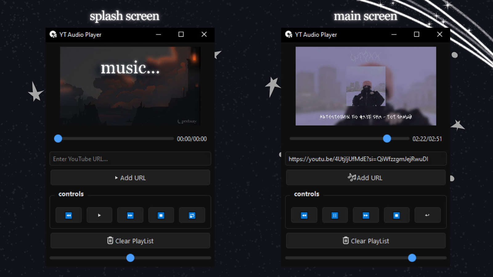

# YT Audio Player — Lightweight Desktop YouTube Audio Player

[](README.md)
[](README.ru.md)



**YT Audio Player** is a desktop app developed in Python
 that lets you listen to audio from YouTube without opening a browser. The main goal is to reduce system resource usage (CPU/RAM) while listening to music, with a simple and clean interface.

Instead of a heavy browser with tabs and video, you get a lightweight audio player that runs in the background.

## Problem & Solution

**Problem:** Modern browsers eat up tons of RAM and CPU power, even when you're just listening to YouTube music in a background tab.

**Solution:** We extract only the audio stream directly from the link and send it to a native player (VLC). This means:
*   **Lower CPU usage** (no video decoding)
*   **Less RAM usage** (no heavy browser)
*   **Distraction-free listening** in a minimal interface

## Features

*   🎵 **Direct playback:** Paste a YouTube link, the app finds and plays the audio right away
*   ⚡ **Low resource usage:** Much lighter than a browser thanks to `yt-dlp` (extraction) and `python-vlc` (playback)
*   🖥️ **Minimal interface:** Just what you need for music (player, playlist, clear button)

## Installation & Setup

### Requirements

Make sure you have these installed:
1.  **VLC Media Player:** [Download from official site](https://www.videolan.org/vlc/)
    *   *Note:* `python-vlc` is just a wrapper and needs VLC installed
2.  **Python 3.10 or higher**
3.  **Git** (optional, for cloning)

### Instructions

1.  **Clone the repository:**
    ```bash
    git clone https://github.com/your-username/yt-audio-player.git
    cd yt-audio-player
    ```

2.  **Create a virtual environment (recommended):**
    ```bash
    python -m venv venv
    source venv/bin/activate  # For Linux/Mac
    venv\Scripts\activate  # For Windows
    ```

3.  **Install dependencies:**
    ```bash
    pip install -r requirements.txt
    ```

4.  **Run the app:**
    ```bash
    python main.py
    ```

## Tech Stack

*   **Python 3.10+**
*   **PyQt6** — GUI framework
*   **python-vlc** — VLC media player bindings (handles audio playback)
*   **yt-dlp** — Powerful library for extracting direct audio links and metadata from YouTube (youtube-dl fork)

## How It Works (Architecture)

1.  **Input:** User enters a YouTube link in the "Paste YouTube URL..." field and clicks "Add URL"
2.  **Extraction:** The app calls `yt-dlp` in a background thread (so the UI doesn't freeze). `yt-dlp` finds the best available audio stream and returns a direct link to it (e.g., `*.m4a` or `*.webm`)
3.  **Playback:** The link gets passed to a `python-vlc` instance. VLC starts streaming and playing the audio
4.  **Control:** PyQt6 handles button clicks (Play/Pause/Next) and displays the current playlist

## Contact

PrxBxny - [GitHub](https://github.com/PrxBxny)
