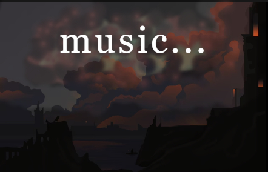

# YT Audio Player — Легковесный десктопный аудиоплеер для YouTube

[](README.md)
[](README.ru.md)

<!--  -->

**YT Audio Player** — это десктопное приложение написанное на Python, которое позволяет слушать аудио из YouTube, не открывая браузер. Главная цель проекта — снизить нагрузку на системные ресурсы (CPU/RAM) при прослушивании музыки, обеспечив при этом простой и понятный интерфейс.

Вместо тяжелого браузера с вкладками и видео, вы получаете легкий аудиоплеер, который работает в фоне.

## Проблема и решение

**Проблема:** Современные браузеры потребляют огромное количество оперативной памяти и энергии процессора, даже если вы просто слушаете музыку на YouTube в фоновой вкладке.

**Решение:** Мы извлекаем только аудиодорожку напрямую по ссылке и передаем ее в нативный плеер (VLC). Это позволяет:
*   **Снизить нагрузку на ЦП** (видеопоток не декодируется).
*   **Сэкономить оперативную память** (нет тяжелого браузера).
*   **Слушать музыку без отвлечений** в минималистичном интерфейсе.

## Особенности

*   🎵 **Прямое воспроизведение:** Вставьте ссылку на YouTube, приложение само найдет и начнет играть аудио.
*   ⚡ **Низкое потребление ресурсов:** Намного легче браузера благодаря использованию `yt-dlp` (извлечение) и `python-vlc` (воспроизведение).
*   🖥️ **Минималистичный интерфейс:** Только то, что нужно для музыки (плеер, список воспроизведения, очистка).

## Установка и запуск

### Предварительные требования

Убедитесь, что на вашей системе установлены:
1.  **VLC Media Player:** Сам плеер. [Скачать с официального сайта](https://www.videolan.org/vlc/).
    *   *Примечание:* `python-vlc` — это просто обертка, он требует наличия установленного VLC.
2.  **Python 3.10 или выше.**
3.  **Git** (опционально, для клонирования).

### Инструкция

1.  **Клонируйте репозиторий:**
    ```bash
    git clone https://github.com/ваш-username/yt-audio-player.git
    cd yt-audio-player
    ```

2.  **Создайте виртуальное окружение (рекомендуется):**
    ```bash
    python -m venv venv
    source venv/bin/activate  # Для Linux/Mac
    venv\Scripts\activate  # Для Windows
    ```

3.  **Установите зависимости:**
    ```bash
    pip install -r requirements.txt
    ```

4.  **Запустите приложение:**
    ```bash
    python main.py
    ```

## Стек технологий

*   **Python 3.10+**
*   **PyQt6** — Графический интерфейс.
*   **python-vlc** — Биндинги для медиаплеера VLC (отвечает за воспроизведение звука).
*   **yt-dlp** — Мощная библиотека для извлечения прямых ссылок на аудио и метаданных с YouTube (форк youtube-dl).

## Как это работает (Архитектура)

1.  **Ввод:** Пользователь вводит ссылку YouTube в поле "Вставь YouTube URL..." и нажимает "Add URL".
2.  **Извлечение:** Приложение вызывает `yt-dlp` в фоновом потоке (чтобы не блокировать интерфейс). `yt-dlp` находит лучший доступный аудиопоток и возвращает прямую ссылку на него (например, `*.m4a` или `*.webm`).
3.  **Воспроизведение:** Полученная ссылка передается в экземпляр `python-vlc`. VLC начинает стримить и воспроизводить аудио.
4.  **Управление:** PyQt6 обрабатывает нажатия кнопок (Play/Pause/Next) и отображает текущий плеейлист.

## Контакты

PrxBxny - [github](https://github.com/PrxBxny)